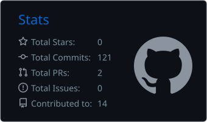

<div align="center">

# Hi, I'm Boris Zambrano 👋

### Software Developer | Full Stack Development | DevOps Enthusiast

Software developer with **3+ years of experience** building and maintaining web applications, working across frontend, backend, databases, and content management systems.

I am currently pursuing a **Master's Degree in DevOps at UNIR**, expanding my knowledge in automation, cloud infrastructure, continuous integration, continuous delivery, monitoring, and modern software deployment practices.

I enjoy solving problems, learning new technologies, and building reliable solutions that create real value.

</div>

---

## 👨‍💻 About Me

- 💼 More than **3 years of experience in software development**
- 🎓 Currently pursuing a **Master's Degree in DevOps at UNIR**
- 🚀 Interested in software architecture, automation, CI/CD, cloud computing, and scalable applications
- 🌱 Continuously improving my development and DevOps skills
- 🤝 Comfortable collaborating with multidisciplinary and agile teams
- 🎯 Focused on writing clean, maintainable, and efficient code
- 📍 Based in Ecuador

---

## 🛠️ Technologies and Tools

### Languages

<p>
  
  
  
  
  
  
  
  
</p>

### Frameworks and Libraries

<p>
  
  
  
  
  
</p>

### Databases

<p>
  
  
  
  
</p>

### Development and DevOps

<p>
  
  
  
  
  
</p>

### CMS

<p>
  
</p>

---

## 🚀 Professional Focus

My professional experience has allowed me to participate in different stages of the software development lifecycle, including:

- Frontend and backend development
- API integration
- Relational and non-relational database management
- Application maintenance and continuous improvement
- Version control and collaborative development
- Problem-solving and debugging
- Deployment automation and DevOps practices

I am particularly interested in connecting software development with modern DevOps practices to create applications that are easier to build, test, deploy, monitor, and scale.

---

## 📚 Currently Learning

- DevOps culture and methodologies
- Continuous Integration and Continuous Delivery
- Infrastructure automation
- Containerization and orchestration
- Cloud computing
- Application monitoring and observability
- Software architecture and scalability

---

## 📊 GitHub Statistics

## 📊 GitHub Statistics

<table width="100%" align="center">
  <tr>
    <td width="50%" align="center">
      
    </td>
    <td width="50%" align="center">
      
    </td>
  </tr>
</table>

---

## 🧩 A Little More About Me

```javascript
const boris = {
  role: "Software Developer",
  experience: "3+ years",
  education: "Master's Degree in DevOps at UNIR — In progress",
  languages: [
    "JavaScript",
    "C#",
    "Java",
    "Python",
    "PHP",
    "HTML",
    "CSS",
    "SQL"
  ],
  technologies: [
    "React",
    "Next.js",
    "Angular",
    "Node.js",
    ".NET",
    "WordPress"
  ],
  databases: [
    "MySQL",
    "SQL Server",
    "PostgreSQL",
    "MongoDB"
  ],
  interests: [
    "DevOps",
    "Cloud Computing",
    "CI/CD",
    "Automation",
    "Software Architecture"
  ],
  mindset: "Continuous learning and continuous improvement"
};
```

---

## 🤝 Connect With Me

<p align="center">
  <a href="https://www.linkedin.com/in/boris-zambrano-suarez-104b4121a/">
    
  </a>
  <a href="mailto:borisdavid779@gmail.com">
    
  </a>
</p>

<div align="center">

### Thanks for visiting my profile!

*"Great software is not only built—it is continuously improved, automated, monitored, and delivered."*

</div>
